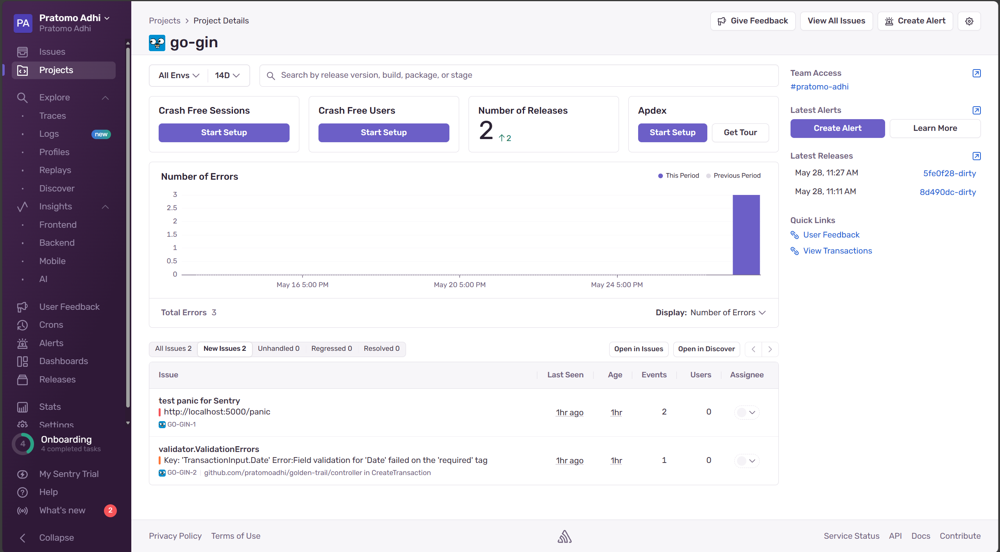

# Golden Trail - Finance Tracker API

Golden Trail is a backend API service written in Go to help you track your financial transactions efficiently. It provides secure user authentication, transaction management, and comprehensive reporting.

---

## Features

- **User Authentication:** Register, login with JWT-based auth.
- **Transaction Management:** Create, update, delete, and list financial transactions.
- **Swagger API Documentation:** Interactive API docs available at `/swagger/index.html`.
- **Automated Tests:** Unit and integration tests with `go test`.
- **Dockerized:** Ready-to-use Dockerfile and docker-compose setup for easy deployment.
- **Continuous Deployment:** Automated deployment pipeline using GitHub Actions.
- **Code Review:** Enforced code review with pull requests and linting using `golangci-lint`.
- **Error Monitoring:** Integrated with [Sentry](https://sentry.io) for real-time error tracking.

---

## Getting Started

### Prerequisites

- [Docker](https://www.docker.com/get-started)
- [Docker Compose](https://docs.docker.com/compose/install/)
- Go 1.23+ (for local development)

### Running with Docker Compose

```bash
git clone https://github.com/pratomoadhi/golden-trail.git
cd golden-trail
docker-compose up --build
```

The API will be available at: `http://localhost:5000`

Swagger docs: `http://localhost:5000/swagger/index.html`

---

## Configuration

All configuration is done via environment variables:

| Variable    | Description           | Example            |
|-------------|-----------------------|--------------------|
| PORT        | API server port       | 5000               |
| DB_HOST     | Database host         | db                 |
| DB_PORT     | Database port         | 5432               |
| DB_USER     | Database user         | postgres           |
| DB_PASSWORD | Database password     | postgres           |
| DB_NAME     | Database name         | goldentrail-db     |
| JWT_SECRET  | JWT signing secret    | your_jwt_secret    |
| SENTRY_DSN  | Sentry DSN for errors | your_jsentry_dsn   |

---

## Running Tests

Run tests locally with:

```bash
go test ./test -v
```

Test coverage reports are included.

---

## API Documentation (Swagger)

Swagger docs are auto-generated and available at:

```bash
http://localhost:5000/swagger/index.html
```

You can interact with the API endpoints directly via this UI.


---

## Continuous Integration and Deployment

We use **GitHub Actions** for:

- Running tests and linters on every pull request.  
- Automatically deploying to your server or cloud provider after merging to `master`.

Example van be viewed in `.github/workflows/go.yml`:

---

## Code Review Process

- All changes must be submitted via Pull Requests (PR).  
- PRs require at least one approval before merging.  
- Code must pass all tests and lint checks.  
- Please write clear commit messages and include testing steps in PR descriptions.

---

## Error Monitoring with Sentry

Golden Trail is integrated with [Sentry](https://sentry.io) to capture runtime errors and panics.

To enable:

- Set `SENTRY_DSN` environment variable with your project's DSN.  
- The app will automatically send errors to Sentry for real-time monitoring and alerts.



---

## License

MIT License © 2025 Your Name

---

Feel free to contribute and improve Golden Trail!  
Questions? Reach out via issues or contact me directly.

